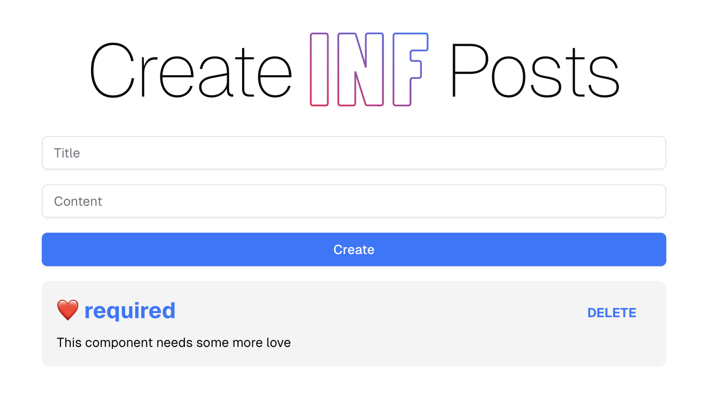

# Code Assignment

Welcome to the code assignment! This project is based on the `create-t3-turbo` starter kit, which provides a monorepo setup with Next.js, tRPC, and more. Please follow the instructions below to set up the development environment and deploy your work.

If you encounter any issues with the setup, refer to the original repository for troubleshooting: [create-t3-turbo](https://github.com/t3-oss/create-t3-turbo).

---

## Getting Started

### 1. Install Dependencies

Make sure you have [PNPM](https://pnpm.io/) installed globally on your machine.

```bash
# Install dependencies
pnpm install

# Copy environment variables
cp .env.example .env

# Push the database schema
pnpm db:push
```

### 2. Running the Development Environment

Start the development environment by running:

```bash
pnpm dev
```

This will start the Next.js web application.

- The Next.js app will be available at `http://localhost:3000`

---

## Assignment Details

> [!NOTE]
>
> We’re excited to have you on board! This assignment is designed to give you and us a taste of what it’s like to work together. We love test-driven development, so your primary goal is to write meaningful unit tests, complete the tasks, and ensure all tests make sense and pass.

To get started, you can clone, fork, or submit a PR to this repo. However, we prefer that you clone or fork the repository, complete the tasks in a **private GitHub repo**, and invite us (GitHub user @fuchsvomwalde, @timlgl) to review it. This ensures your submission remains confidential.

### If you're applying for a frontend role:
- Navigate to `apps/nextjs` and locate the `__test__/*.test.tsx` files. You'll find predefined unit tests with some TODOs.
- Enhance the existing tests with meaningful additions, then follow a test-driven approach to complete the tasks: 

  1. Start by reviewing the `TODOs` in the unit tests and implementing them thoughtfully. Focus on functionality first—don’t sweat the small stuff. Just ensure the tests are meaningful, clean, and pass successfully.



  2. Check out the screenshot. Our UX designer is currently unavailable, and while designing UIs isn’t your main responsibility at INF (we have members for that), we’d love to see your creative touch on the blog post list component. Think of your future colleagues as your users—bring in small but impactful improvements to make the experience better and more delightful.

### If you're applying for a backend role:
Goal is to implement the functionality of commenting on posts, emoji reactions to posts and comments in the backend. 

- Explore `packages/api` and `packages/db`.

  1. **Minimal Feature Scope**: Ensure a basic version (backend) of commenting and emoji reactions is functional and tested through tests in a way that you would be comfortable to ship the feature. 

  2. **Improvements & Documentation**: Include detailed comments explaining how you would further refine, stabilize, or optimize the feature.


- Work iteratively until all tests pass and tasks are successfully implemented.

### If you're applying for a full-stack role:
Goal is to implement the functionality of commenting on posts. 

- Explore `packages/api` and `packages/db`.

  1. **Minimal Feature Scope**: Ensure a basic version (backend & frontend) of commenting is functional and tested in a way that you would be comfortable to ship the feature. 

- Work iteratively until all tests pass and tasks are successfully implemented.

### Additional Notes:
- Commit your code regularly to maintain a clean and structured Git history.
- We encourage the use of AI tools like ChatGPT and GitHub Copilot – we use them too! Feel free to leverage them as you would in a real-world work environment.
- Set up a comfortable workspace, grab your favorite snack, and enjoy working through the assignment.

> [!NOTE]
>
> Please **do not invest more than 4 hours** in this assignment. We follow the same principle and do not spend more than 2 hours reviewing a single submission. After 4 hours, submit whatever you have completed, regardless of progress. We value efficiency and real-world prioritization over perfection.

- Our estimated time to complete this assignment:
  - **Project setup:** ~10 minutes
  - **Understanding the tech stack:** ~30-60 minutes *(depends on your experience)*
  - **Task completion:** 3-5 hours *(so please prioritize, to ensure you can submit something within 4 hours)*
  - **Submission:** 10-20 minutes

We will review your submission within the same time frame and get back to you with feedback or next steps. Your feedback on our time estimates is also highly appreciated.

---

Good luck!


